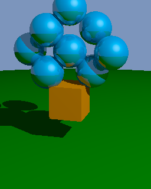

# ray-tracing

Using ray tracing, a rendering algorithm, we computed a series of images. We explored scene geometries, light sources, diffuse and specular shading, as well as mirror reflection. 

Example A

Example B

Example C

